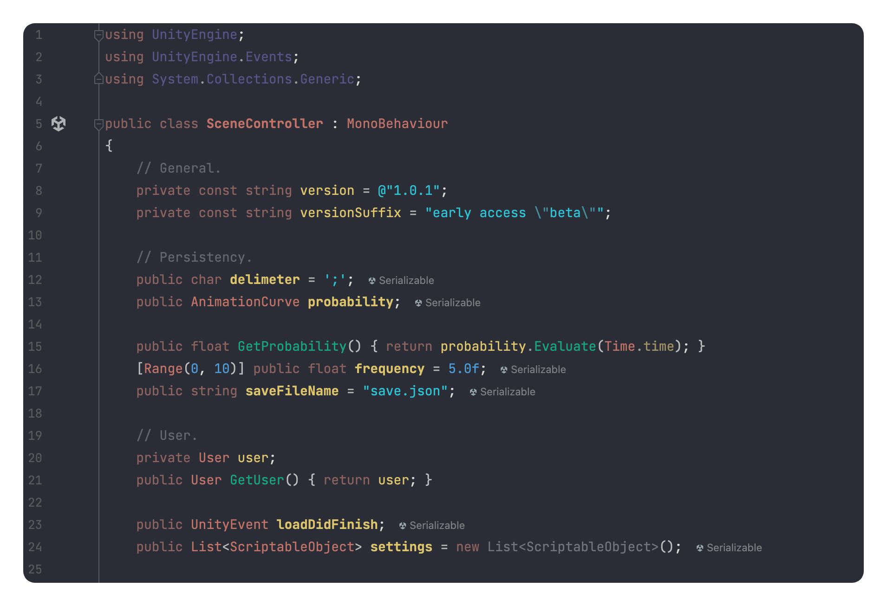

# eppz! (C# theme for Rider IDE)

Very bare-bones port of eppz! theme. Currently (19.07.2022) Rider does not allow separate colors for specific keywords which makes porting this theme 1-1 almost impossible. Nonetheless, maybe someone will find it helpful.

Recommended to use alongside OneDark editor theme:
1. Preferences -> Appearance & Behavior -> Get More Themes
2. Install and choose OneDark theme
3. Preferences -> Editor -> Color Scheme -> press "cog" button -> Import Scheme -> eppz_theme.jar

Original theme by Geri Borbas:
- [iOS.Library.eppz_Xcode](https://github.com/Geri-Borbas/iOS.Library.eppz_Xcode)
- [VSCode.Extension.eppz_Code](https://github.com/Geri-Borbas/VSCode.Extension.eppz_Code) 
